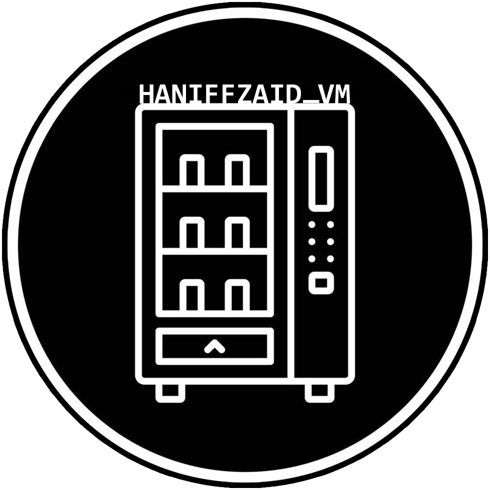
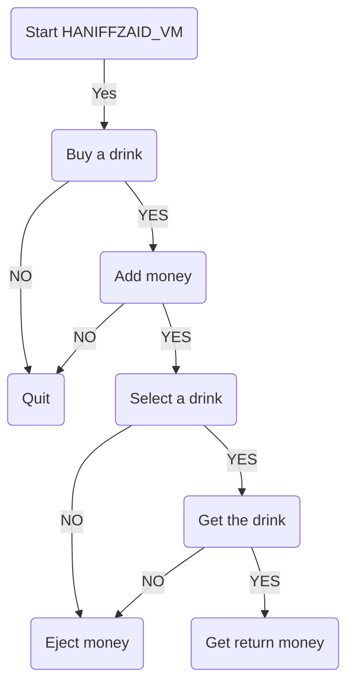

<a name="readme-top"></a>

  <h1 align="center"><a href="https://github.com/HaniffZaid/Project-Vending-Machine-HaniffZaid.git">
    
  </a>

  HaniffZaid_VM</h1>
   <p align="center">
    My first individual data science project. More to come insyaAllah!
    <br />
  </p>

<!-- TABLE OF CONTENTS -->
<details>
  <summary>Table of Contents</summary>
  <ol>
    <li>
      <a href="#about-the-project">About The Project</a>
      <ul>
        <li><a href="#built-with">Built With</a></li>
        <li><a href="#flowchart">Flowchart</a></li>
      </ul>
    </li>
    <li>
      <a href="#getting-started">Getting Started</a>
      <ul>
        <li><a href="#prerequisites">Prerequisites</a></li>
        <li><a href="#installation">Installation</a></li>
      </ul>
    </li>
    <li><a href="#usage">Usage</a></li>
    <li><a href="#contact">Contact</a></li>
    <li><a href="#acknowledgement">Acknowledgement</a></li>
  </ol>
</details>


<!-- About The Projects -->
## About The Project

I am currently a student in Datascience Bootcamp by adnexio, lectured by Dr. Fairoza. For my first individual project, I have been tasked to produce a vending machine program.

After several days of studying on some examples, I decided to produce a mini vending machine program which sells six drinking products that my family and I used the most. I named it **HaniffZaid_VM**, and complete it with these features:
- Accept Cash Only
- Select Product
- Make Change
- Return Cash
- Sold Out
- Exact Change Only

Accept Cash Only
----------------
  
_As a vendor_  
_I want a vending machine that accepts cash only_  
_So that I can collect money from the customer_  

The vending machine will accept valid cash (RM1, RM5, RM10 and RM20) and reject invalid ones.  When a
valid cash is inserted the amount of the cash will be added to the current amount and the display will be updated.
When there are no cash inserted, the machine displays INSERT CASH.  Rejected cash are placed in the cash return.

Select Product
--------------

_As a vendor_  
_I want customers to select products_  
_So that I can give them an incentive to put money in the machine_  

There are six products which are: 

| Code  | Item | Price |
| ------------- | ------------- | ------------- |
| 00  | Drinking Water  | RM1  |
| 01  | DutchLady Full Cream  | RM2  |
| 02  | Milo  | RM3  |
| 03  | Nescafe Original  | RM3  |
| 04  | Nescafe Latte  | RM3  |
| 05  | Nescafe Mocha  | RM3  |

When the respective button is pressed and enough money has been inserted, the product is dispensed and the machine displays THANK YOU.  If the display is
checked again, it will display INSERT CASH and the current amount will be set to RM0.  If there is not enough money
inserted then the machine displays PRICE and the price of the item and subsequent checks of the display will display
either INSERT CASH or the current amount as appropriate.

Make Change
-----------

_As a vendor_  
_I want customers to receive correct change_  
_So that they will use the vending machine again_  

When a product is selected that costs less than the amount of money in the machine, then the remaining amount is placed
in the cash return.

Return Cash
-----------

_As a vendor_  
_I want customers to have their money returned_  
_So that they can change their mind about buying stuff from the vending machine_  

When the return cash button is pressed, the money that the customer has placed in the machine is returned and the display shows
INSERT CASH.

Sold Out
--------

_As a vendor_  
_I want customers to be told when the item they have selected is not available_  
_So that they can select another item_  

When the item selected by the customer is out of stock, the machine displays SOLD OUT.  If the display is checked again,
it will display the amount of money remaining in the machine or INSERT CASH if there is no money in the machine.

Exact Change Only
-----------------

_As a vendor_  
_I want customers to be told when exact change is required_  
_So that they can determine if they can buy something with the money they have before inserting it_  

When the machine is not able to make change with the money in the machine for any of the items that it sells, it will
display EXACT CHANGE ONLY instead of INSERT CASH.

## Built With

My project HANIFFZAID_VM is bootstrapped by:

* Python

<p align="right">(<a href="#readme-top">back to top</a>)</p>

## Flowchart



<!-- GETTING STARTED -->
## Getting Started

### Prerequisites
Python > 3.6 

### Installation

1. Clone the repository:

    ```bash
    git clone https://github.com/HaniffZaid/Project-Vending-Machine-HaniffZaid.git
    ```

2. Run the vending machine script:

    ```bash
    python vending_machine.py
    ```

<p align="right">(<a href="#readme-top">back to top</a>)</p>


<!-- USAGE -->
## Usage

The usage of the vending machine follows a traditional vending machine functionalities where user needs to insert enough money before pressing a button to dispense a drink.

1. **Insert money**: Insert notes (one by one) to add money to your user credit balance.
2. **Buy a drink**: Select a drink and then choose to buy it. 
3. **Eject money**: At any point, you can choose to eject all the money in your user credit balance. 

<p align="right">(<a href="#readme-top">back to top</a>)</p>


<!-- CONTACT -->
## Contact

Mohd Haniff Bin Zaid - [LinkedIn](https://www.linkedin.com/in/HaniffZaid) - [Github](https://github.com/HaniffZaid) - [Gmail](mailto:anipzaid@gmail.com)

Project Link: https://github.com/HaniffZaid/Project-Vending-Machine-HaniffZaid.git

<p align="right">(<a href="#readme-top">back to top</a>)</p>


<!-- ACKNOWLEDGEMENT -->
## Acknowledgement

Dr. Fairoza Amira - [Github](https://github.com/FairozaAmira) - fairozaamira@gmail.com

Usmaan Alii - [Github](https://github.com/usmaanalii/vending-machine.git)

<p align="right">(<a href="#readme-top">back to top</a>)</p>
